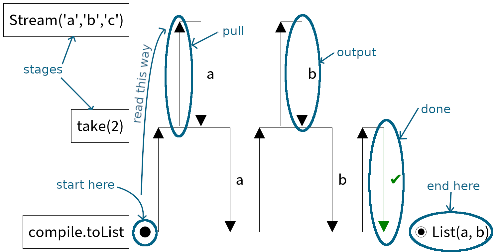
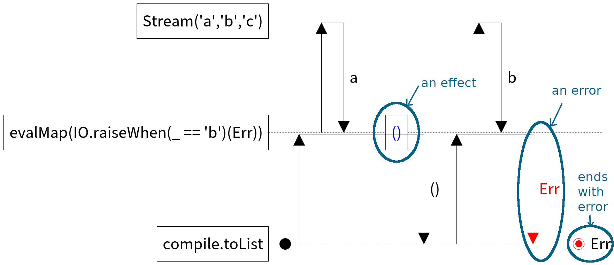

## aquascape

This website is a collection of diagrams for [fs2](https://github.com/typelevel/fs2).

## The basic idea

A stream is split into **stages**.

 - Each stage **pulls** on the stage above.
 - It **outputs** an element to the stage below.
 - If there are no more elements to output, the stage is **done**.
 - It might also evaluate an **effect**.
 - It might raise an **error**.

## How to read the diagrams

### Basics

```scala
Stream('a', 'b', 'c')
  .take(2)
  .compile.toList
```



### Effects and errors

```scala
Stream('a', 'b', 'c')
  .evalMap(x => IO.raiseWhen(x == 'b')(Err))
  .compile.toList
```


